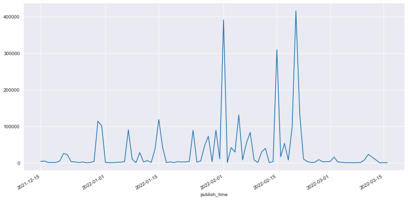
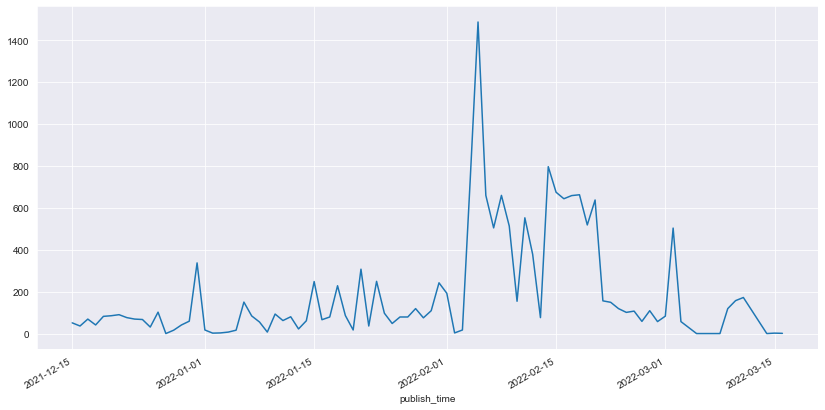
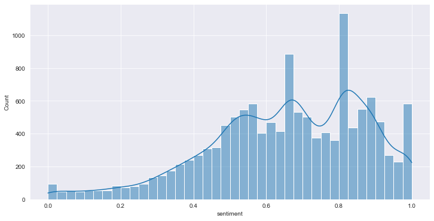
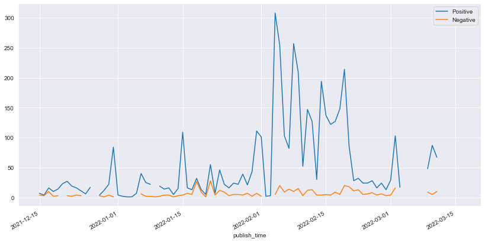
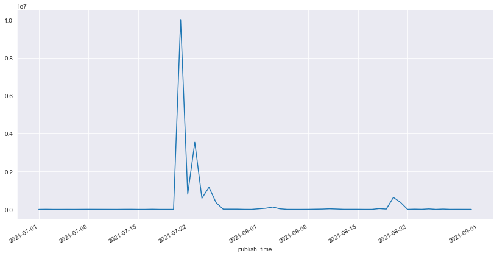
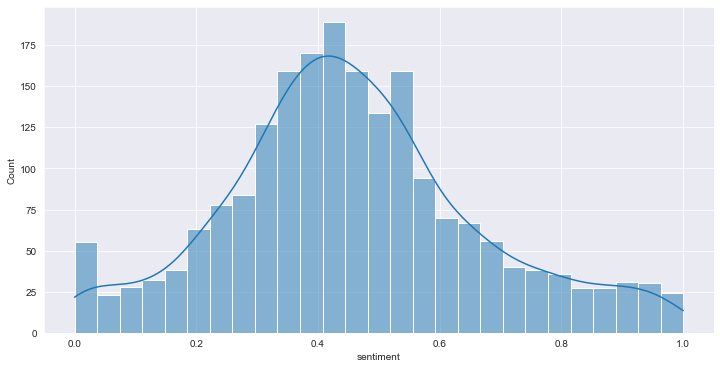

---
categories:
- ""
- ""
date: "2017-10-31T22:26:13-05:00"
description: 
draft: false
image: weibo.jpg
keywords: ""
slug: weibo
title: How Did ANTA Win During the Olympics?
---
This is my Python code for Sentiment Analysis for ANTA during the Olympics. The analysis was used to study and evaluate ANTA's marketing strategy during the Winter Olympics in 2022. For an analytic report, please see [Link](https://github.com/Timsssssssss/my_website22/blob/main/content/blogs/Analytical_Report.pdf)


```python
import pandas as pd
import numpy as np
import matplotlib.pyplot as plt
import seaborn as sns
from snownlp import SnowNLP
import datetime
import jieba.analyse
import re
from wordcloud import WordCloud
sns.set_style("darkgrid")
```


```python
jieba.load_userdict('userdict.txt')
```


```python
df = pd.read_csv("weibo.csv")
```


```python
df['publish_time'] = pd.to_datetime(df['publish_time'],format='%Y-%m-%d')
```

# Clean the context


```python
#Sorce:  https://blog.csdn.net/qq_43814415/article/details/119517978
def clean(line):
    rep=['【】','【','】','👍','🤝',
        '🐮','🙏','🇨🇳','👏','❤️','………','🐰','...、、','，，','..','💪','🤓',
         '⚕️','👩','🙃','😇','🍺','🐂','🙌🏻','😂','📖','😭','✧٩(ˊωˋ*)و✧','🦐','？？？？','//','😊','💰','😜','😯',
         '(ღ˘⌣˘ღ)','✧＼٩(눈౪눈)و/／✧','🌎','🍀','🐴',
         '🌻','🌱','🌱','🌻','🙈','(ง•̀_•́)ง！','🉑️','💩',
         '🐎','⊙∀⊙！','🙊','【？','+1','😄','🙁','👇🏻','📚','🙇',
         '🙋','！！！！','🎉','＼(^▽^)／','👌','🆒','🏻',
         '🙉','🎵','🎈','🎊','0371-12345','☕️','🌞','😳','👻','🐶','👄','\U0001f92e\U0001f92e','😔','＋1','🛀','🐸','🐷','➕1',
         '🌚','：：','💉','√','x','！！！','🙅','♂️','💊','👋','o(^o^)o','mei\u2006sha\u2006shi','💉','😪','😱',
         '🤗','关注','……','(((╹д╹;)))','⚠️','Ծ‸Ծ','⛽️','😓','🐵',
         '🙄️','🌕','…','😋','[]','[',']','→_→','💞','😨','&quot;','😁','ฅ۶•ﻌ•♡','😰','🎙️',
         '🤧','😫','(ง•̀_•́)ง','😁','✊','🚬','😤','👻','😣','：','😷','(*^▽^)/★*☆','🐁','🐔','😘','🍋','(✪▽✪)','(❁´ω`❁)','1⃣3⃣','(^_^)／','☀️',
	     '🎁','😅','🌹','🏠','→_→','🙂','✨','❄️','•','🌤','💓','🔨','👏','😏','⊙∀⊙！','👍','✌(̿▀̿\u2009̿Ĺ̯̿̿▀̿̿)✌',
         '😊','👆','💤','😘','😊','😴','😉','🌟','♡♪..𝙜𝙤𝙤𝙙𝙣𝙞𝙜𝙝𝙩•͈ᴗ•͈✩‧₊˚','👪','💰','😎','🍀','🛍','🖕🏼','😂','(✪▽✪)','🍋','🍅','👀','♂️','🙋🏻','✌️','🥳','￣￣)σ',
         '😒','😉','🦀','💖','✊','💪','🙄','🎣','🌾','✔️','😡','😌','🔥','❤','🏼','🤭','🌿','丨','✅','🏥','ﾉ','☀','5⃣⏺1⃣0⃣','🚣','🎣','🤯','🌺',
         '🌸','\u200b','\ue627OOTD','收起d'
         ]
    pattern_0=re.compile('#.*?#')#在用户名处匹配话题名称
    pattern_1=re.compile('【.*?】')#在用户名处匹配话题名称
    pattern_2=re.compile('肺炎@([\u4e00-\u9fa5\w\-]+)')#匹配@
    pattern_3=re.compile('@([\u4e00-\u9fa5\w\-]+)')#匹配@
    #肺炎@环球时报
    pattern_4=re.compile(u'[\U00010000-\U0010ffff\uD800-\uDBFF\uDC00-\uDFFF]')#匹配表情
    pattern_7=re.compile('L.*?的微博视频')
    pattern_8=re.compile('（.*?）')
    #pattern_9=re.compile(u"\|[\u4e00-\u9fa5]*\|")#匹配中文

    line=line.replace('O网页链接','')
    line=line.replace('-----','')
    line=line.replace('①','')
    line=line.replace('②','')
    line=line.replace('③','')
    line=line.replace('④','')
    line=line.replace('>>','')
    line=re.sub(pattern_0, '', line,0) #去除话题
    line=re.sub(pattern_1, '', line,0) #去除【】
    line=re.sub(pattern_2, '', line,0) #去除@
    line=re.sub(pattern_3, '', line,0) #去除@
    line=re.sub(pattern_4, '', line,0) #去除表情
    line=re.sub(pattern_7, '', line,0) 
    line=re.sub(pattern_8, '', line,0) 
    line=re.sub(r'\[\S+\]', '', line,0) #去除表情符号
    
    for i in rep:
        line=line.replace(i,'')
    return line

```


```python
df['content'] = df.apply(lambda x:clean(x['content']),axis = 1)
```

# Data Inspection


```python
df['voice'] = df['forward_num']+df['comment_num']+df['like_num']
V = pd.DataFrame()
```


```python
V['voice'] = df.groupby('publish_time').sum()['voice']
V['num'] = df.groupby('publish_time').count()['voice']
```


```python
V['voice'].plot(figsize=(14,7))
```


    <AxesSubplot:xlabel='publish_time'>


    

    


```python
V['num'].plot(figsize=(14,7))
```


    <AxesSubplot:xlabel='publish_time'>


    

    


```python
V.to_csv('安踏微博声量.csv',index= True)
```

# Sentiment Analysis


```python
def cal_score(df):
    n = len(df['content'])
    sentiment = np.empty(n)
    for i in range(n):
        text = SnowNLP(df['content'][i])
        sent = text.sentences
        score = list()
        for sen in sent:
            s = SnowNLP(sen)
            score.append(s.sentiments)

        sentiment[i] = np.nanmean(score)
    return sentiment
```


```python
df['sentiment'] = cal_score(df)
```

    C:\Users\ty\AppData\Local\Temp/ipykernel_8532/3858428932.py:12: RuntimeWarning: Mean of empty slice
      sentiment[i] = np.nanmean(score)
    


```python
df['sentiment'].describe()
```


    count    13280.000000
    mean         0.654502
    std          0.215907
    min          0.000000
    25%          0.518764
    50%          0.667780
    75%          0.816982
    max          1.000000
    Name: sentiment, dtype: float64


```python
plt.figure(figsize=(12,6))
sns.histplot(df['sentiment'],kde = True)
```


    <AxesSubplot:xlabel='sentiment', ylabel='Count'>


    

    


```python
print('positive:',len(df[df['sentiment'] >= 0.8]))
print('negative:',len(df[df['sentiment'] <= 0.2]))
```

    positive: 4301
    negative: 485
    


```python
A = pd.DataFrame()
A['Total'] = df.groupby('publish_time').count()['sentiment']
A['Positive'] = df[df['sentiment']>=0.8].groupby('publish_time').count()['sentiment']
A['Negative'] = df[df['sentiment']<=0.2].groupby('publish_time').count()['sentiment']
```


```python
A[['Positive','Negative']].plot(figsize=(14,7))
```


    <AxesSubplot:xlabel='publish_time'>


    

    


```python
A.to_csv('安踏每日正负情感.csv',index = True)
```


```python
df[['sentiment']].to_csv('安踏微博情感分析.csv',index = False)
```


```python
wo = df[(df['publish_time'] >= '2022-02-04')&(df['publish_time'] <= '2022-02-20')].reset_index()
print('positive:',len(wo[wo['sentiment'] >= 0.8]))
print('negative:',len(wo[wo['sentiment'] <= 0.2]))
```

    positive: 2597
    negative: 170
    

# Topic Analysis


```python
def Get_Key_Words(df,Num = 10,only_adv = False):
    segments = []
    for index, row in df.iterrows(): 
        content = row['content']
        content = content.replace('中国队','')
        content = content.replace('加油','')
        content = content.replace('冬奥','')
        content = content.replace('奥运','')
        content = content.replace('健儿','')
        if only_adv:
            words = jieba.analyse.extract_tags(content, topK=20, allowPOS=('a','ad','vn','nt'))
        else:
            words = jieba.analyse.extract_tags(content, topK=20, allowPOS=('nr', 'n', 'vn', 'v','nz','nt','a'))
        for word in words:
            segments.append({'word':word, 'count':1})
    dfSeg = pd.DataFrame(segments)
    dfWord = dfSeg.groupby('word').sum()[['count']].sort_values('count',ascending=False).reset_index().head(Num)
    return dfWord
```


```python
# Source: https://www.bbsmax.com/A/q4zVPxgW5K/

def create_word_cloud(df,num = 15,wid = 4000,hei = 2000):
    frequencies = {}
    for index,row in df.iterrows():
        frequencies[row['word']] = float(row['count'])
    wc = WordCloud(
        font_path="./SimHei.ttf",
        max_words=num,
        width=wid, 
        height=hei,
        margin=2,
        background_color='white',
        prefer_horizontal=1.5
    )
    word_cloud = wc.generate_from_frequencies(frequencies)
    plt.imshow(word_cloud)
    plt.axis("off")
    plt.show()


```


```python
wo_topic = Get_Key_Words(wo,30)
create_word_cloud(wo_topic)
```


    

    


```python
df2 = df.copy()
```


```python
df2 = df2[(~df2['content'].str.contains('围观冬奥'))&(~df2['content'].str.contains('冬奥能量'))&(~df2['content'].str.contains('红包'))&
         (~df2['content'].str.contains('品牌时刻'))]
```


```python
t_1_18 = df2[((df2['publish_time'] == '2022-01-18')|(df2['publish_time'] == '2022-01-21'))&(df2['sentiment'] <= 0.2)].reset_index()
```


```python
create_word_cloud(Get_Key_Words(t_1_18,30))
```


    

    


```python
df2.groupby('publish_time').count().sort_values('voice',ascending=False)[['voice']].head(6)
```


<div>
<style scoped>
    .dataframe tbody tr th:only-of-type {
        vertical-align: middle;
    }

    .dataframe tbody tr th {
        vertical-align: top;
    }

    .dataframe thead th {
        text-align: right;
    }
</style>
<table border="1" class="dataframe">
  <thead>
    <tr style="text-align: right;">
      <th></th>
      <th>voice</th>
    </tr>
    <tr>
      <th>publish_time</th>
      <th></th>
    </tr>
  </thead>
  <tbody>
    <tr>
      <th>2022-02-05</th>
      <td>1407</td>
    </tr>
    <tr>
      <th>2022-02-14</th>
      <td>705</td>
    </tr>
    <tr>
      <th>2022-02-06</th>
      <td>624</td>
    </tr>
    <tr>
      <th>2022-02-20</th>
      <td>623</td>
    </tr>
    <tr>
      <th>2022-02-15</th>
      <td>608</td>
    </tr>
    <tr>
      <th>2022-02-18</th>
      <td>599</td>
    </tr>
  </tbody>
</table>
</div>


```python
t_2_20 = df2[(df2['publish_time'] == '2022-02-20')].reset_index()
t_2_15 = df2[(df2['publish_time'] == '2022-02-15')].reset_index()
t_2_5 = df2[df2['publish_time'] == '2022-02-05'].reset_index()
neg =  wo[wo['sentiment'] <= 0.2].reset_index()
post_mon = df2[(df2['publish_time'] >= '2022-03-01')].reset_index()
```


```python
create_word_cloud(Get_Key_Words(t_2_20,30))
```


    

    


```python
create_word_cloud(Get_Key_Words(t_2_15,30))
```


    

    


```python
create_word_cloud(Get_Key_Words(t_2_5,30))
```


    

    


```python
create_word_cloud(Get_Key_Words(neg,30))
```


    

    


```python
create_word_cloud(Get_Key_Words(post_mon,30))
```


    

    


# Hongxing Erke


```python
erke = pd.read_csv("erke.csv")
erke['publish_time'] = pd.to_datetime(erke['publish_time'],format='%Y-%m-%d')
```


```python
erke['content'] = erke.apply(lambda x:clean(x['content']),axis = 1)
```


```python
erke.head(5)
```


<div>
<style scoped>
    .dataframe tbody tr th:only-of-type {
        vertical-align: middle;
    }

    .dataframe tbody tr th {
        vertical-align: top;
    }

    .dataframe thead th {
        text-align: right;
    }
</style>
<table border="1" class="dataframe">
  <thead>
    <tr style="text-align: right;">
      <th></th>
      <th>publish_time</th>
      <th>user_name</th>
      <th>content</th>
      <th>weibo_link</th>
      <th>forward_num</th>
      <th>comment_num</th>
      <th>like_num</th>
    </tr>
  </thead>
  <tbody>
    <tr>
      <th>0</th>
      <td>2021-08-31</td>
      <td>橘家慧子</td>
      <td>草率了，买了那么多双鸿星尔克拢龙鞋子代言这不就来了嘛真要化身蜈蚣精了</td>
      <td>https://weibo.com/5170218722/Kw3Bo7Uva?refer_f...</td>
      <td>0</td>
      <td>0</td>
      <td>0</td>
    </tr>
    <tr>
      <th>1</th>
      <td>2021-08-31</td>
      <td>挚研宏微</td>
      <td>挚研宏微安踏，真正的运动品牌之光  提起国内的运动品牌，相信很多人都能叫出李宁、安踏、特步等...</td>
      <td>https://weibo.com/7475419357/Kw3uGk9RE?refer_f...</td>
      <td>0</td>
      <td>0</td>
      <td>69</td>
    </tr>
    <tr>
      <th>2</th>
      <td>2021-08-31</td>
      <td>阿亮陪你看世界</td>
      <td>良心企业，值得赞扬！一方有难，八方支援，这就是中国力量！实实在在赞了 一把！</td>
      <td>https://weibo.com/2500620180/Kw3uG1sQy?refer_f...</td>
      <td>0</td>
      <td>0</td>
      <td>1</td>
    </tr>
    <tr>
      <th>3</th>
      <td>2021-08-31</td>
      <td>我的-hobby</td>
      <td>鸿星尔克买的鞋子，现在穿感觉厚了点</td>
      <td>https://weibo.com/7555559185/Kw323zr5b?refer_f...</td>
      <td>0</td>
      <td>0</td>
      <td>0</td>
    </tr>
    <tr>
      <th>4</th>
      <td>2021-08-31</td>
      <td>吃-盼-妞</td>
      <td>热度过去了这么久，我才来支持 “鸿星尔克”</td>
      <td>https://weibo.com/2533083211/Kw2P1EFrP?refer_f...</td>
      <td>0</td>
      <td>0</td>
      <td>1</td>
    </tr>
  </tbody>
</table>
</div>


```python
erke['voice'] = erke['forward_num']+erke['comment_num']+erke['like_num']
E = pd.DataFrame()
```


```python
E['voice'] = erke.groupby('publish_time').sum()['voice']
E['num'] = erke.groupby('publish_time').count()['voice']
```


```python
E['voice'].plot(figsize=(14,7))
```


    <AxesSubplot:xlabel='publish_time'>


    

    


```python
E.to_csv('鸿星尔克微博声量.csv',index = True)
```

## Sentiment Analysis


```python
erke['sentiment'] = cal_score(erke)
```

    C:\Users\ty\AppData\Local\Temp/ipykernel_62248/3858428932.py:12: RuntimeWarning: Mean of empty slice
      sentiment[i] = np.nanmean(score)
    


```python
t = erke[(erke['publish_time']>= '2021-07-21')&(erke['publish_time']<= '2021-07-25')]
```


```python
tp = erke[erke['publish_time']> '2021-08-01']
pt =  erke[erke['publish_time']< '2021-07-20']
```


```python
plt.figure(figsize=(12,6))
sns.histplot(t['sentiment'],kde = True)
```


    <AxesSubplot:xlabel='sentiment', ylabel='Count'>


    

    


```python
t[['sentiment']].to_csv('鸿星尔克情感分析.csv',index = False)
```


```python
print('positive:',len(t[t['sentiment'] >= 0.8]))
print('negative:',len(t[t['sentiment'] <= 0.2]))
```

    positive: 152
    negative: 191
    

## Topic Analysis


```python
t_pos = t[t['sentiment'] >= 0.8]
t_neg = t[t['sentiment'] <= 0.2]
```


```python
create_word_cloud(Get_Key_Words(t_pos,30,True),15,1000,500)
```


    

    


```python
create_word_cloud(Get_Key_Words(t_neg,30,True),15,1000,500)
```


    

    


```python
create_word_cloud(Get_Key_Words(tp,30))
```


    

    


```python

```
